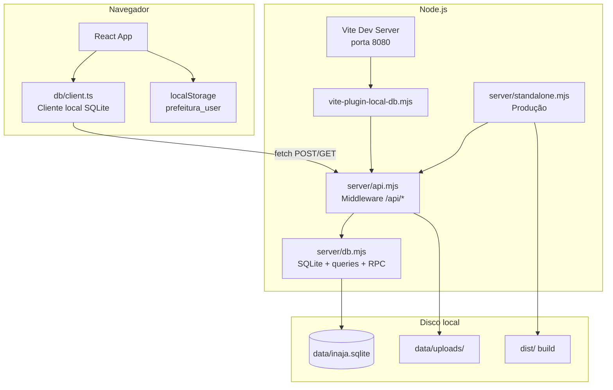

# Manual de Infraestrutura — Inajá Fornecimento Digital

> **Propósito:** arquitetura, API, SQLite, deploy e operação.

**Documentos relacionados:** [README](./README.md) · [Mapa do código](./MAPA-DO-CODIGO.md) · [Formatos/API](./FORMATOS-E-CONTRATOS.md) · [Decisões](./DECISOES-ARQUITETURA.md) · [Guia operação](./GUIA-OPERACAO.md) · [Troubleshooting](./TROUBLESHOOTING.md)

---

## 1. Resumo executivo

O projeto é uma **SPA React** com **backend embutido em Node.js** que roda **SQLite local**. Não depende de Supabase na nuvem nem de internet para persistir dados.

| Aspecto | Tecnologia |
|---------|------------|
| Frontend | React 18 + TypeScript + Vite 5 |
| UI | Tailwind CSS + shadcn/ui (Radix) |
| Roteamento | React Router DOM 6 |
| Estado servidor | TanStack React Query |
| Banco | SQLite (`node:sqlite`) em `data/inaja.sqlite` |
| API | Middleware Node em `/api/*` |
| Autenticação | RPC local + sessão em `localStorage` (sem JWT/servidor) |
| Anexos | Arquivos em `data/uploads/` |
| Porta padrão | `8080` |

### Princípio arquitetural

O frontend foi originalmente escrito para **Supabase**. Para rodar 100% local, o arquivo `src/integrations/db/client.ts` foi substituído por um **cliente compatível** que fala com a API local via `fetch`, mantendo a mesma interface (`db.from()`, `db.rpc()`, `db.storage`, `db.channel()`).

---

## 2. Diagrama de arquitetura



### Fluxo de uma requisição típica

```
Componente React
  → db.from('tarefas').select('*')
    → QueryBuilder.execute()
      → POST /api/query  { table, action, filters, order... }
        → runQuery(db, body)  em server/db.mjs
          → SQL no SQLite
        ← { data: [...], error: null }
      ← JSON
    ← Promise resolvida
  → setState / React Query
```

---

## 3. Estrutura de pastas (infraestrutura)

```
inaja-fornecimento-digital/
├── data/                          # Dados persistentes locais
│   ├── inaja.sqlite               # Banco SQLite principal
│   ├── uploads/                   # Anexos de solicitações
│   └── README.md
├── dist/                          # Build de produção (gerado)
├── manual do projeto/             # Manuais (IA, visual, infra)
├── public/                        # Assets estáticos servidos pelo Vite
├── scripts/                       # Utilitários Node
│   ├── set-aleksandro-password.mjs
│   └── backup-db.mjs                 # Backup SQLite + uploads
├── server/                        # Backend local
│   ├── api.mjs                    # Rotas HTTP /api/*
│   ├── db.mjs                     # SQLite, migrations, queries, RPC
│   └── standalone.mjs             # Servidor produção (dist + API)
├── src/                           # Frontend React
│   ├── integrations/db/
│   │   ├── client.ts              # Cliente local (NÃO é Supabase cloud)
│   │   └── types.ts               # Tipos gerados (referência)
│   └── ...
├── supabase/                      # Migrações SQL legadas (referência cloud)
│   └── migrations/
├── vite-plugin-local-db.mjs       # Plugin Vite → injeta API no dev server
├── vite.config.ts
├── rodar.bat                      # Inicia dev no Windows
├── configurar-env.bat             # Info sobre banco local
├── package.json
└── .env.example                   # Vazio — não precisa de .env
```

---

## 4. Modos de execução

### 4.1 Desenvolvimento (padrão)

```bash
npm run dev
# ou: rodar.bat
```

| Item | Valor |
|------|-------|
| Comando | `vite` |
| Porta | `8080` |
| Host | `::` (IPv4 + IPv6) |
| URL | `http://localhost:8080` |
| API | Injetada pelo plugin `localDbPlugin()` |
| Hot reload | Sim (Vite HMR) |
| Banco | Criado/aberto em `data/inaja.sqlite` no startup |

**O que o plugin faz (`vite-plugin-local-db.mjs`):**
1. Chama `openDatabase()` na primeira requisição
2. Registra `createLocalDbMiddleware()` no servidor Vite
3. Funciona em `configureServer` (dev) e `configurePreviewServer` (preview)

### 4.2 Preview (build local testado)

```bash
npm run build
npm run preview
```

- Serve `dist/` via Vite preview
- API local continua ativa pelo mesmo plugin

### 4.3 Produção / standalone

```bash
npm run build
npm start
# equivale a: node server/standalone.mjs
```

| Item | Valor |
|------|-------|
| Servidor | `http` nativo do Node |
| Porta | `process.env.PORT` ou `8080` |
| Host | `0.0.0.0` |
| Frontend | Arquivos estáticos de `dist/` |
| SPA fallback | Qualquer rota desconhecida → `index.html` |
| API | Mesmo `handleApi()` de `api.mjs` |
| Banco | `data/inaja.sqlite` (caminho relativo ao projeto) |

### 4.4 Scripts npm

| Script | Comando | Uso |
|--------|---------|-----|
| `dev` | `vite` | Desenvolvimento |
| `build` | `vite build` | Gera `dist/` |
| `build:dev` | `vite build --mode development` | Build modo dev |
| `preview` | `vite preview` | Preview do build |
| `start` | `node server/standalone.mjs` | Produção |
| `lint` | `eslint .` | Lint |

---

## 5. API HTTP local

Base URL: `/api` (mesma origem do frontend — sem CORS em uso normal)

### 5.1 Endpoints

| Método | Rota | Função |
|--------|------|--------|
| `GET` | `/api/health` | Health check — retorna `{ ok, mode: "local-sqlite", db }` |
| `POST` | `/api/query` | CRUD genérico em tabelas permitidas |
| `POST` | `/api/rpc` | Funções RPC (autenticação) |
| `POST` | `/api/storage/upload` | Upload de anexo (base64) |
| `GET` | `/api/files/{path}` | Download de arquivo em `data/uploads/` |
| `POST` | `/api/storage/remove` | Remove arquivos do disco |
| `OPTIONS` | `/api/*` | Retorna 204 (preflight) |

### 5.2 POST /api/query

**Body JSON:**
```json
{
  "table": "tarefas",
  "action": "select",
  "select": "*",
  "filters": [{ "column": "status", "value": "todo" }],
  "order": [{ "column": "ordem", "ascending": true }],
  "limit": 50,
  "payload": {},
  "payloads": [],
  "onConflict": "nome",
  "ignoreDuplicates": false
}
```

**Ações suportadas:** `select`, `insert`, `update`, `delete`, `upsert`

**Tabelas permitidas (whitelist):**
```
solicitantes, empresas, observacoes, modelos,
solicitacoes, tarefas, credores_fixos, empenhos_mensais
```

> **Nota:** `usuarios` **não** está na whitelist. Acesso a usuários/senhas é **somente via RPC**.

**Resposta padrão:**
```json
{ "data": ..., "error": null }
// ou
{ "data": null, "error": { "message": "...", "code": "..." } }
```

**Códigos de erro comuns:**
| Code | Significado |
|------|-------------|
| `INVALID_TABLE` | Tabela não permitida |
| `INVALID_ACTION` | Ação desconhecida |
| `BAD_REQUEST` | Update/delete sem filtro |
| `23505` | Violação UNIQUE (compatível com Postgres) |
| `DB_ERROR` | Erro SQLite genérico |

### 5.3 POST /api/rpc

**Body JSON:**
```json
{
  "fn": "usuario_login",
  "args": { "_username": "aleksandro", "_senha": "<senha-local-nao-versionada>" }
}
```

**Funções RPC implementadas:**

| Função | Args | Retorno |
|--------|------|---------|
| `usuario_status` | `_username` | `[{ existe, tem_senha }]` |
| `usuario_login` | `_username`, `_senha` | `boolean` |
| `usuario_set_senha` | `_username`, `_senha` | `boolean` |

**Hash de senha:** scrypt com salt aleatório, formato `scrypt$<salt_hex>$<hash_hex>`

### 5.4 Storage (anexos)

**Upload** — `POST /api/storage/upload`:
```json
{
  "bucket": "solicitacao-anexos",
  "path": "1234-abc-arquivo.pdf",
  "contentBase64": "...",
  "contentType": "application/pdf",
  "upsert": false
}
```

- Bucket é ignorado no disco (tudo vai para `data/uploads/`)
- `safePath()` impede path traversal (`..`, barras invertidas)
- Limite no frontend: **10 MB** por arquivo (`AttachmentUploader`)

**Download** — `GET /api/files/{path}`:
- Serve arquivo de `data/uploads/`
- Cache: `max-age=31536000` (1 ano)
- MIME por extensão: png, jpg, gif, webp, pdf

**URL assinada (cliente):**
```javascript
`${origin}/api/files/${path}`
```
Não há expiração real — URL é permanente enquanto o arquivo existir.

---

## 6. Banco de dados SQLite

### 6.1 Arquivo e configuração

| Item | Valor |
|------|-------|
| Caminho | `data/inaja.sqlite` |
| Driver | `DatabaseSync` de `node:sqlite` (Node.js nativo) |
| Journal | `PRAGMA journal_mode = WAL` |
| Foreign keys | `PRAGMA foreign_keys = ON` |
| Criação | Automática no primeiro `openDatabase()` |

### 6.2 Inicialização (migrate + seed)

Executado em toda abertura do banco (`server/db.mjs`):

1. **`migrate(db)`** — `CREATE TABLE IF NOT EXISTS` para todas as tabelas
2. **`seed(db)`** — insere usuários iniciais sem credenciais

**Usuários seed:**
```javascript
["aleksandro", "maicon", "luana"]
// usuários permanecem sem senha_hash até o primeiro acesso
```

### 6.3 Schema completo

#### `usuarios`
| Coluna | Tipo | Notas |
|--------|------|-------|
| id | TEXT PK | UUID |
| username | TEXT UNIQUE | lowercase na comparação |
| senha_hash | TEXT | scrypt ou NULL |
| created_at | TEXT | ISO datetime |
| updated_at | TEXT | ISO datetime |

#### `solicitantes`
| Coluna | Tipo |
|--------|------|
| id | TEXT PK |
| nome | TEXT UNIQUE |
| created_at | TEXT |

#### `empresas`
| Coluna | Tipo |
|--------|------|
| id | TEXT PK |
| nome | TEXT UNIQUE |
| created_at | TEXT |

#### `observacoes`
| Coluna | Tipo |
|--------|------|
| id | TEXT PK |
| texto | TEXT UNIQUE |
| created_at | TEXT |

#### `modelos`
| Coluna | Tipo |
|--------|------|
| id | TEXT PK |
| nome | TEXT UNIQUE |
| form_data | TEXT (JSON) |
| items | TEXT (JSON) |
| created_at, updated_at | TEXT |

#### `solicitacoes`
| Coluna | Tipo |
|--------|------|
| id | TEXT PK |
| solicitante | TEXT |
| empresa | TEXT |
| data_solicitacao | TEXT |
| observacoes | TEXT |
| items | TEXT (JSON) |
| valor_total | REAL |
| anexos | TEXT (JSON) |
| assinatura | TEXT (data URL) |
| created_at | TEXT |

#### `tarefas`
| Coluna | Tipo |
|--------|------|
| id | TEXT PK |
| titulo | TEXT |
| descricao | TEXT |
| responsavel | TEXT |
| prioridade | TEXT (baixa/media/alta) |
| status | TEXT (todo/doing/done) |
| ordem | INTEGER |
| prazo | TEXT |
| created_at, updated_at | TEXT |

#### `credores_fixos`
| Coluna | Tipo |
|--------|------|
| id | TEXT PK |
| nome | TEXT |
| documento | TEXT |
| departamento | TEXT |
| valor_mensal | REAL |
| descricao | TEXT |
| created_at, updated_at | TEXT |

#### `empenhos_mensais`
| Coluna | Tipo |
|--------|------|
| id | TEXT PK |
| credor_id | TEXT FK → credores_fixos |
| ano | INTEGER |
| mes | INTEGER (1–12) |
| status | TEXT (pendente/empenhado) |
| valor | REAL |
| numero_empenho | TEXT |
| observacao | TEXT |
| empenhado_em | TEXT |
| created_at, updated_at | TEXT |
| UNIQUE | (credor_id, ano, mes) |

### 6.4 Colunas JSON

Serialização automática em `runQuery`:
| Tabela | Colunas JSON |
|--------|--------------|
| `modelos` | `form_data`, `items` |
| `solicitacoes` | `items`, `anexos` |

### 6.5 Arquivos auxiliares SQLite

| Arquivo | Descrição |
|---------|-----------|
| `inaja.sqlite-wal` | Write-Ahead Log (modo WAL) |
| `inaja.sqlite-shm` | Shared memory (modo WAL) |

Ambos são ignorados pelo `.gitignore`. O arquivo principal `inaja.sqlite` **pode** ser versionado.

---

## 7. Cliente Supabase local (frontend)

**Arquivo:** `src/integrations/db/client.ts`

### Flags exportadas
```typescript
isLocalDatabase = true
isLocalDatabase = true
isLocalDatabase = true        // indica modo SQLite local
```

### Classes implementadas

| Classe | Emula |
|--------|-------|
| `QueryBuilder` | `db.from().select().eq().order().limit()` |
| `StorageBucket` | `db.storage.from().upload()` |
| `Channel` | `db.channel().on('postgres_changes')` |

### Realtime (pseudo)

Não há WebSocket nem Postgres LISTEN. O "realtime" funciona assim:
1. Após `insert`/`update`/`delete` via API, o cliente emite evento local
2. `Channel.on({ table: 'tarefas' }, callback)` registra listener em memória
3. Sincroniza apenas **entre componentes/abas do mesmo navegador**

Tabelas que usam realtime no app:
- `tarefas`
- `solicitacoes`
- `solicitantes`, `empresas`, `observacoes`

---

## 8. Autenticação (infraestrutura)

### Camada servidor
- RPC `usuario_login` valida scrypt no SQLite
- **Não há** middleware de autenticação nas rotas `/api/query` ou `/api/storage`
- Qualquer cliente que alcance a API pode ler/escrever tabelas permitidas

### Camada cliente
- `AuthContext` guarda username em `localStorage` (`prefeitura_user`)
- `RequireAuth` redireciona para `/login` se não houver user
- **Não envia token** nas requisições à API

### Implicação de segurança
Este modelo é adequado para **uso local/intranet confiável**. Não deve ser exposto diretamente à internet sem camada adicional de autenticação no servidor.

---

## 9. Build e assets

### Vite config (`vite.config.ts`)

| Opção | Valor |
|-------|-------|
| Plugin React | `@vitejs/plugin-react-swc` |
| Plugin DB | `localDbPlugin()` |
| Alias | `@` → `./src` |
| Tagger | `lovable-tagger` (só em development) |
| Porta | 8080 |
| Host | `::` |

### Saída do build
- Pasta: `dist/`
- SPA: `index.html` + assets hashed em `dist/assets/`
- `standalone.mjs` faz fallback para `index.html` em rotas client-side

### Dependências de geração de documentos (client-side)
Toda exportação PDF/Word/Excel roda **no navegador**:
- `jspdf`, `html2canvas` — PDFs
- `docx`, `file-saver` — Word
- `xlsx-js-style` — Excel

Não há endpoints de servidor para geração de documentos.

---

## 10. Variáveis de ambiente e configuração

### Estado atual
**Não é necessário arquivo `.env`** para o banco local.

`.env.example` contém apenas comentário explicativo.

`configurar-env.bat` informa que Supabase cloud não é mais usado.

### Variáveis opcionais

| Variável | Padrão | Uso |
|----------|--------|-----|
| `PORT` | `8080` | Porta do `standalone.mjs` |

### Legado Supabase cloud
- Pasta `supabase/migrations/` contém SQL original para Postgres
- `src/integrations/db/client.ts` — tipos gerados do schema cloud
- `scripts/find-supabase-key.mjs` — utilitário de busca de chaves (legado)
- **Em runtime, nada disso é usado** — o `client.ts` local substitui o cliente cloud

---

## 11. Git e arquivos ignorados

`.gitignore` relevante:
```
node_modules/
dist/
.env / .env.local
data/uploads/*        # anexos não versionados
data/*.sqlite-wal     # WAL temporário
data/*.sqlite-shm     # SHM temporário
```

**Versionado normalmente:**
- `data/inaja.sqlite` (banco com dados seed)
- `data/uploads/.gitkeep`
- Código-fonte, manuais, scripts

---

## 12. Scripts utilitários

### `scripts/set-aleksandro-password.mjs`
```bash
node scripts/set-aleksandro-password.mjs
```
- Cria ou atualiza usuário `aleksandro` com senha informada localmente, nunca versionada
- Testa login via `runRpc("usuario_login")`
- Útil após reset do banco ou troca acidental de senha

### `scripts/backup-db.mjs` (legado find-supabase-key removido)
- Legado — busca chaves Supabase em pastas do sistema
- Não necessário para operação local

### `rodar.bat`
- Verifica Node.js
- `npm install --legacy-peer-deps` se `node_modules` ausente
- `npm run dev`

### `configurar-env.bat`
- Exibe informações sobre banco local (sem configurar nada)

---

## 13. Diagrama de deploy recomendado

### Uso local (atual)
```
PC da prefeitura
  └── rodar.bat
        └── Vite :8080 + SQLite em data/
```

### Produção em máquina única
```
Servidor Windows/Linux
  ├── npm run build
  ├── npm start  (standalone.mjs)
  ├── data/inaja.sqlite  (persistente)
  └── data/uploads/      (persistente)
```

### Checklist de deploy
1. Instalar Node.js 20+ (requer `node:sqlite` nativo)
2. `npm install --legacy-peer-deps`
3. `npm run build`
4. Garantir que `data/` existe e é gravável
5. `npm start` ou configurar serviço Windows/Linux apontando para `server/standalone.mjs`
6. Backup periódico de `data/inaja.sqlite` e `data/uploads/`

---

## 14. Monitoramento e diagnóstico

### Health check
```bash
curl http://localhost:8080/api/health
```
Resposta esperada:
```json
{ "ok": true, "mode": "local-sqlite", "db": "data/inaja.sqlite" }
```

### Logs
| Contexto | Onde |
|----------|------|
| Dev | Console do terminal (`[local-db] SQLite em data/inaja.sqlite`) |
| Standalone | `Inaja local: http://localhost:8080` |
| Erros API | HTTP 400/500 com JSON `{ error: { message } }` |
| Frontend | Console do navegador (DevTools) |

### Problemas comuns

| Sintoma | Causa provável | Solução |
|---------|----------------|---------|
| "Node.js não encontrado" | Node não instalado | Instalar de nodejs.org |
| Porta 8080 em uso | Outro processo | Matar processo ou mudar porta no vite.config / PORT |
| `dist/ não encontrada` | Build não feito | `npm run build` antes de `npm start` |
| Login falha aleksandro | Senha alterada | `node scripts/set-aleksandro-password.mjs` |
| Upload falha | Pasta sem permissão | Verificar escrita em `data/uploads/` |
| Dados sumiram | Banco apagado | Restaurar backup de `inaja.sqlite` |
| Realtime não sincroniza entre PCs | Esperado | Realtime é só no mesmo navegador |

---

## 15. Requisitos de sistema

| Requisito | Mínimo |
|-----------|--------|
| Node.js | 20+ (para `node:sqlite` nativo) |
| npm | 9+ |
| SO | Windows, Linux, macOS |
| RAM | 512 MB+ para Node + SQLite |
| Disco | ~50 MB código + crescimento do banco/uploads |
| Rede | Não obrigatória (100% offline após `npm install`) |
| Navegador | Chrome, Edge, Firefox modernos |

---

## 16. Segurança — resumo para IA

### O que existe
- Hash scrypt para senhas
- `timingSafeEqual` na verificação de senha
- Whitelist de tabelas na API
- Sanitização de identificadores SQL
- Proteção path traversal em uploads
- Senha só criada uma vez (`usuario_set_senha` exige `senha_hash IS NULL`)

### O que NÃO existe
- HTTPS (responsabilidade do reverse proxy)
- Autenticação nas rotas de dados
- Rate limiting
- CORS configurado (mesma origem)
- RLS / permissões por usuário no banco
- Auditoria de ações
- Backup automático

### Recomendações se expor na rede
1. Colocar atrás de VPN ou rede interna
2. Adicionar middleware de sessão/token na API
3. Usar HTTPS via nginx/Caddy
4. Backup diário de `data/`

---

## 17. Mapa: componente → tabela/API

| Componente / Hook | Tabela(s) | API |
|-------------------|-----------|-----|
| `Login.tsx` | — | RPC auth |
| `useDataManager` | solicitantes, empresas, observacoes | /api/query |
| `Solicitacoes.tsx` (export PDF) | solicitacoes | /api/query insert |
| `useTemplates` | modelos | /api/query |
| `HistoryView` | solicitacoes | /api/query |
| `KanbanBoard` | tarefas | /api/query |
| `CredoresFixos` | credores_fixos, empenhos_mensais | /api/query |
| `AttachmentUploader` | — | /api/storage/* |
| `GlobalSearch` | solicitacoes | /api/query |

---

## 18. Referência rápida de arquivos críticos

| Arquivo | Responsabilidade |
|---------|------------------|
| `vite.config.ts` | Porta, plugins, alias |
| `vite-plugin-local-db.mjs` | Injeta API no Vite |
| `server/api.mjs` | Rotas HTTP |
| `server/db.mjs` | Schema, queries, RPC, paths |
| `server/standalone.mjs` | Servidor produção |
| `src/integrations/db/client.ts` | Ponte frontend → API |
| `src/contexts/AuthContext.tsx` | Sessão localStorage |
| `data/inaja.sqlite` | Persistência |
| `data/uploads/` | Binários |

---

## 19. Instruções para IA — tarefas de infraestrutura

### Ao ajudar com problemas de servidor
1. Verificar se Node 20+ está instalado
2. Confirmar se porta 8080 está livre
3. Testar `GET /api/health`
4. Verificar existência de `data/inaja.sqlite`

### Ao modificar o banco
1. Alterar `migrate()` em `server/db.mjs`
2. Atualizar whitelist em `runQuery` se nova tabela
3. Atualizar `types.ts` se necessário (referência)
4. Considerar migração de dados existentes

### Ao adicionar endpoint
1. Implementar em `handleApi()` em `api.mjs`
2. Expor no `client.ts` se o frontend precisar
3. Manter formato `{ data, error }`

### Ao fazer deploy
1. Preferir `npm run build && npm start`
2. Não depender de Vite em produção
3. Preservar pasta `data/` entre deploys
4. Documentar backup do SQLite

### O que NÃO fazer
- Não reativar Supabase cloud sem reescrever `client.ts`
- Não expor `/api/query` publicamente sem auth
- Não armazenar senhas em texto puro
- Não deletar `data/` em deploys
- Não assumir que realtime funciona entre máquinas

---

*Última atualização: julho/2026 — Infraestrutura local SQLite + Node.js, Prefeitura Municipal de Inajá/PR.*
