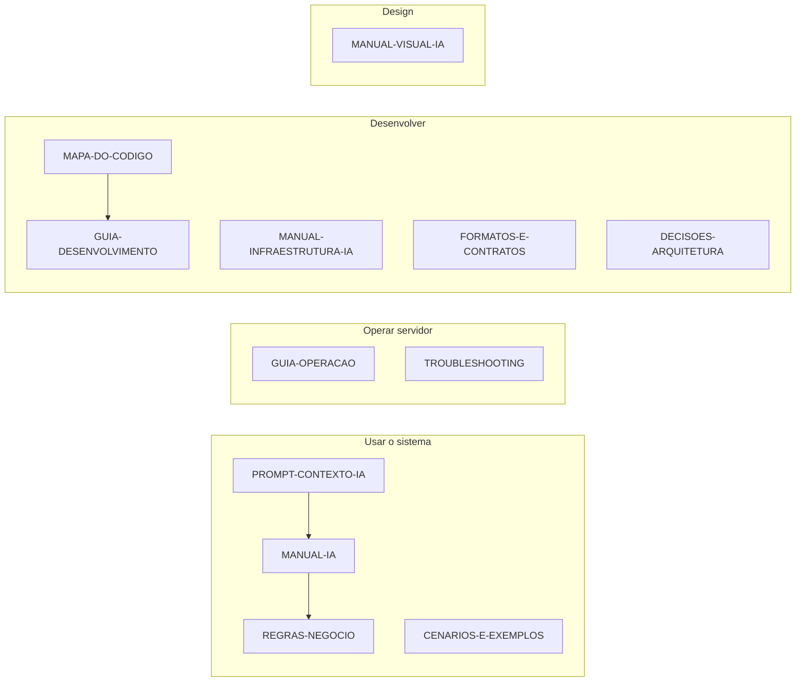

# Manual do Projeto — Inajá Fornecimento Digital

Documentação completa para **humanos**, **operadores** e **IAs** que trabalham neste sistema da Prefeitura Municipal de Inajá/PR.

---

## Mapa mental



---

## Índice completo (14 documentos)

### 🚀 Início rápido

| Documento | Descrição |
|-----------|-----------|
| [PROMPT-CONTEXTO-IA.md](./PROMPT-CONTEXTO-IA.md) | **Comece aqui (IA)** — bloco para colar no chat |
| [REFERENCIA-RAPIDA.md](./REFERENCIA-RAPIDA.md) | Uma página: rotas, comandos, cores, tabelas |
| [CENARIOS-E-EXEMPLOS.md](./CENARIOS-E-EXEMPLOS.md) | Situações reais com passo a passo e dados exemplo |

### 📘 Funcional

| Documento | Descrição |
|-----------|-----------|
| [MANUAL-IA.md](./MANUAL-IA.md) | Todos os módulos, fluxos, exportações, atalhos |
| [REGRAS-NEGOCIO.md](./REGRAS-NEGOCIO.md) | Regras fixas — senhas, diárias, lote, kanban |
| [GLOSSARIO.md](./GLOSSARIO.md) | Termos do sistema e da prefeitura |

### 🎨 Visual

| Documento | Descrição |
|-----------|-----------|
| [MANUAL-VISUAL-IA.md](./MANUAL-VISUAL-IA.md) | Design Emerald Prestige — cores, tipografia, efeitos |

### ⚙️ Infraestrutura e código

| Documento | Descrição |
|-----------|-----------|
| [MANUAL-INFRAESTRUTURA-IA.md](./MANUAL-INFRAESTRUTURA-IA.md) | Arquitetura, API, SQLite, deploy |
| [MAPA-DO-CODIGO.md](./MAPA-DO-CODIGO.md) | Onde está cada arquivo e responsabilidade |
| [FORMATOS-E-CONTRATOS.md](./FORMATOS-E-CONTRATOS.md) | JSON, API, lote, códigos de erro |
| [DECISOES-ARQUITETURA.md](./DECISOES-ARQUITETURA.md) | Por que o sistema foi feito assim (ADRs) |
| [GUIA-DESENVOLVIMENTO.md](./GUIA-DESENVOLVIMENTO.md) | Checklist para alterar código com segurança |

### 🔧 Operação e suporte

| Documento | Descrição |
|-----------|-----------|
| [GUIA-OPERACAO.md](./GUIA-OPERACAO.md) | Backup, rotina diária, produção, manutenção |
| [TROUBLESHOOTING.md](./TROUBLESHOOTING.md) | Problemas comuns + FAQ |

---

## Escolha seu caminho

### 🤖 Sou uma IA ajudando um usuário
1. [PROMPT-CONTEXTO-IA.md](./PROMPT-CONTEXTO-IA.md)
2. [CENARIOS-E-EXEMPLOS.md](./CENARIOS-E-EXEMPLOS.md) — achar cenário parecido
3. [MANUAL-IA.md](./MANUAL-IA.md) — detalhes
4. [TROUBLESHOOTING.md](./TROUBLESHOOTING.md) — se der erro

### 👤 Sou usuário da prefeitura
1. [CENARIOS-E-EXEMPLOS.md](./CENARIOS-E-EXEMPLOS.md)
2. [MANUAL-IA.md](./MANUAL-IA.md)
3. [TROUBLESHOOTING.md](./TROUBLESHOOTING.md)

### 🖥️ Sou responsável pelo servidor
1. [GUIA-OPERACAO.md](./GUIA-OPERACAO.md)
2. [MANUAL-INFRAESTRUTURA-IA.md](./MANUAL-INFRAESTRUTURA-IA.md)
3. [TROUBLESHOOTING.md](./TROUBLESHOOTING.md)

### 💻 Sou desenvolvedor / IA codando
1. [MAPA-DO-CODIGO.md](./MAPA-DO-CODIGO.md)
2. [DECISOES-ARQUITETURA.md](./DECISOES-ARQUITETURA.md)
3. [GUIA-DESENVOLVIMENTO.md](./GUIA-DESENVOLVIMENTO.md)
4. [FORMATOS-E-CONTRATOS.md](./FORMATOS-E-CONTRATOS.md)
5. [MANUAL-VISUAL-IA.md](./MANUAL-VISUAL-IA.md) — se mexer em UI

### 📝 Preciso gerar arquivo de lote
1. [FORMATOS-E-CONTRATOS.md](./FORMATOS-E-CONTRATOS.md) §6
2. [REGRAS-NEGOCIO.md](./REGRAS-NEGOCIO.md) §3
3. [CENARIOS-E-EXEMPLOS.md](./CENARIOS-E-EXEMPLOS.md) §4

---

## Sistema em 30 segundos

| Item | Valor |
|------|-------|
| **O quê** | Hub com 4 módulos administrativos |
| **Para quem** | Prefeitura de Inajá/PR |
| **URL** | http://localhost:8080 |
| **Banco** | SQLite → `data/inaja.sqlite` |
| **Iniciar** | `rodar.bat` ou `npm run dev` |
| **Usuários** | aleksandro, maicon, luana — todos definem senha no primeiro acesso |
| **Visual** | Verde #064E3B + dourado #C9A84C |
| **Dev** | DEV Aleksandro Alves |

### Módulos
1. **Solicitações** — aquisições, PDF, lote, histórico
2. **Tarefas** — Kanban interno
3. **Diárias** — Decreto 019/2025
4. **Credores Fixos** — empenhos mensais

---

## Matriz documento × pergunta

| Pergunta | Documento |
|----------|-----------|
| Como faço login? | CENARIOS §1, MANUAL-IA §3 |
| Como gero PDF? | CENARIOS §2, MANUAL-IA §6 |
| Formato do lote? | FORMATOS §6, REGRAS §3 |
| Quantas diárias numa viagem? | REGRAS §8, CENARIOS §5 |
| Onde fica o código do Kanban? | MAPA-DO-CODIGO |
| Como faço backup? | GUIA-OPERACAO §2 |
| Por que não usa Supabase? | DECISOES ADR-001 |
| Qual cor usar no botão? | MANUAL-VISUAL §2 |
| API POST /api/query? | FORMATOS §2, INFRA §5 |
| Esqueci a senha | TROUBLESHOOTING, CENARIOS §12 |
| O que significa empenho? | GLOSSARIO |

---

## Manutenção desta pasta

**Atualizar documentação quando:**
- Novo módulo ou rota
- Nova tabela ou endpoint
- Mudança de regra de negócio
- Novo problema recorrente (FAQ)
- Decisão arquitetural relevante

**Prioridade de atualização:**
1. REGRAS-NEGOCIO / FORMATOS (se mudou comportamento)
2. MANUAL-IA / CENARIOS (se mudou UX)
3. MAPA-DO-CODIGO / INFRAESTRUTURA (se mudou código)
4. PROMPT-CONTEXTO-IA (resumo para IA)
5. README (índice)

---

## Início rápido técnico

```bash
# Windows
rodar.bat

# Manual
npm install --legacy-peer-deps
npm run dev

# Produção
npm run build && npm start

# Health
curl http://localhost:8080/api/health

# Reset senha aleksandro
node scripts/set-aleksandro-password.mjs
```

---

*14 documentos · Prefeitura Municipal de Inajá · DEV Aleksandro Alves · julho/2026*
